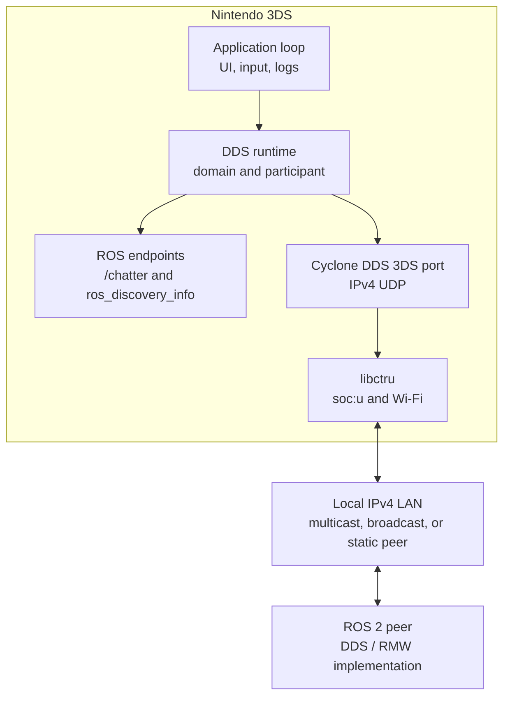

# Architecture Overview

The application runs a native Cyclone DDS participant directly on Nintendo 3DS
hardware. It does not use Micro XRCE-DDS, an agent, `rcl`, or `rclc` at runtime.

## Runtime Layers

1. **libctru platform layer** initializes graphics, input, ROMFS, the SD card,
   and the `soc:u` network service.
2. **Cyclone DDS 3DS port** provides DDS over the console's IPv4 UDP sockets.
3. **DDS runtime wrapper** owns the domain and participant lifecycle.
4. **ROS endpoints** publish `/chatter` and ROS graph metadata using generated
   Cyclone DDS type descriptors.
5. **Application loop** handles controls, periodic publishing, polling,
   diagnostics, and rendering.

## Source Layout

| Path | Responsibility |
| --- | --- |
| `source/main.c` | 3DS lifecycle, input, network setup, UI, and scheduling |
| `source/dds_runtime.c` | DDS domain and participant lifecycle |
| `source/ros2_chatter.c` | `/chatter` topic, writer, reader, QoS, and samples |
| `source/ros2_graph.c` | `ros_discovery_info` publication |
| `source/logging/app_log.c` | Screen log, SD log, and error snapshots |
| `generated/ros_types/` | Cyclone DDS descriptor for `std_msgs/msg/String` |
| `generated/ros_graph/` | Cyclone DDS descriptor for ROS graph metadata |
| `romfs/config.ini` | Built-in runtime defaults |

## Lifecycle

Startup proceeds in this order:

1. Initialize graphics, ROMFS, logging, and `soc:u`.
2. Read built-in configuration, then apply an optional SD-card override.
3. Obtain the active Wi-Fi IPv4 address, netmask, and subnet broadcast address.
4. Create the Cyclone DDS domain and participant.
5. Create `/chatter` endpoints and publish ROS graph metadata.
6. Enter the UI and communication loop.

Shutdown deletes graph and chatter entities, deletes the participant and
domain, closes sockets and logs, and finally stops `soc:u`.

## Cyclone DDS Dependency

The runtime uses
[SinfonIAUniandes/cyclone3dds](https://github.com/SinfonIAUniandes/cyclone3dds).
The fork adds devkitARM/libctru platform backends and produces the static
`libddsc.a` linked into the `.3dsx`.